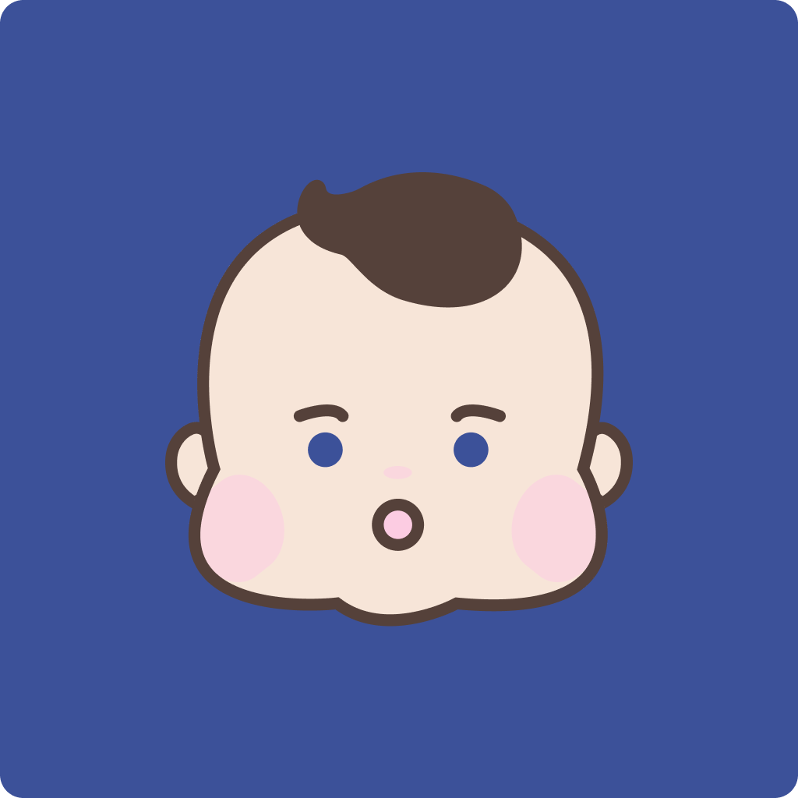

# Eyeku

📆 2022. 09. 05. ~ 2022. 12. 02.

 

## 📱 Screenshots

||||
|:-:|:-:|:-:|
|Strabismus Test|Profile|Records|

 

## 🧑🏻‍💻👩🏻‍💻 Members

|Developer|Developer|Designer|Developer|Developer, PM|
|:-:|:-:|:-:|:-:|:-:|
||||||
|[Ground(김재성)](https://github.com/GroundDev)|[Rey(문종식)](https://github.com/moonjs0113)|[Livvy(최성희)](https://github.com/sunchoi22)|[Smile(신재웅)](https://github.com/sustainable-git)|[Wonny(권지원)](https://github.com/wonny1012)|

 

## Description

Hi there👋! We are team iKu. Let us introduce you our app, Eyeku!

👁Eyeku (Crossed-Eyes Test) is a service that measures the angle of strabismus to check the risk of occurrence at an early stage of child, and continuously records the angle of strabismus to prevent recurrence and record progress after surgery.

🙋Why? Why you dived into this project? Strabismus have to be diagnosed in early age. But there are some parents who are unable to easily meet medical specialist to ask whether his or her child has a strabismus or not. We are struggling to make this world a better place where all children are able to be diagnosed and being tracked with a little effort.

Thank you for concern!😉

 

## Expectations

- Strabismus is diagnosed in early age.
- Provides an easy tool who cares and worries whether his or her child has a strabismus or not.
- Records and tracks recovery process after surgery.

 

## 🛠 Developement Environment

|Environment|Version|
|:-:|:-:|
|Swift|5.7.1|
|Xcode|14.1.0|
|iOS Deployment Target|16.0|

 

## 📚 Tech Stacks

- UIKit & SwiftUI
- ARKit
- XCTest
- SQLite

 

## 🔐 License
- [MIT License](./LICENSE)